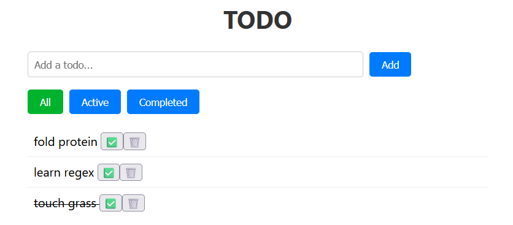

# Todo App: From nothing to fullstack

Because a paper and pen was simply not good enough.

 <br>

## What Is This?

A todo application built with .NET backend and Angular frontend.

## Tech Stack

    - Backend: .NET
    - Frontend: Angular
    - Database: SQLite

## Features

    - Add todos you will never complete
    - Update completion on todos
    - Delete todos and pretend they never existed

## Getting Started

### Prerequisites

    - .NET SDK
    - Node.js & Angular CLI

### Running the Backend

```bash
cd TodoApi
dotnet run
```

### Running the frontend

```bash
cd todo-frontend
ng serve
```

## API Endpoint

| Method    | Endpoint     |  Description   |
| ------- | ------------ | ------- |
| GET | /todos |  Get all todos  |
| POST | /todos |  Add a todo  |
| PUT | /todos{id} |  Pretend you did something  |
| DELETE | /todos{id} |  Revisionist history  |
